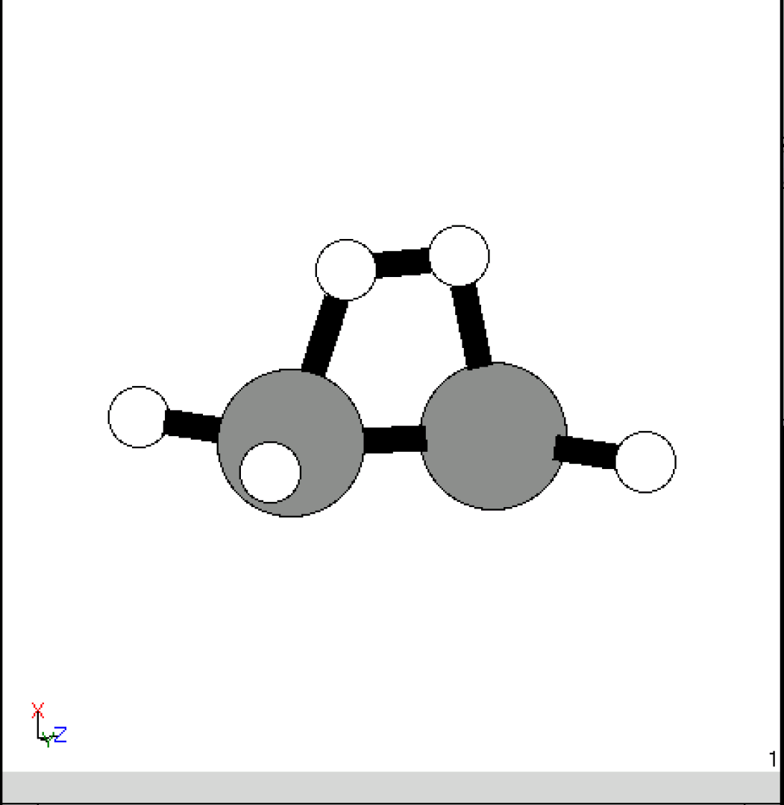
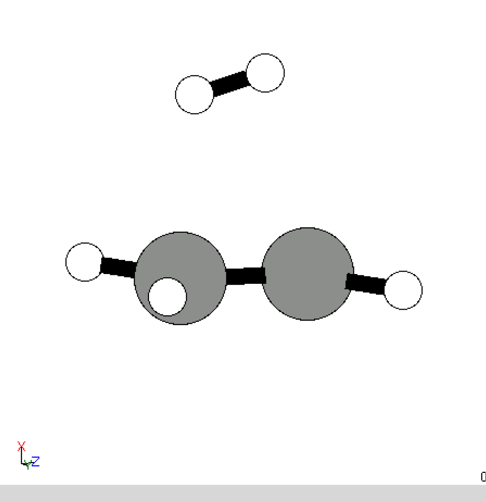
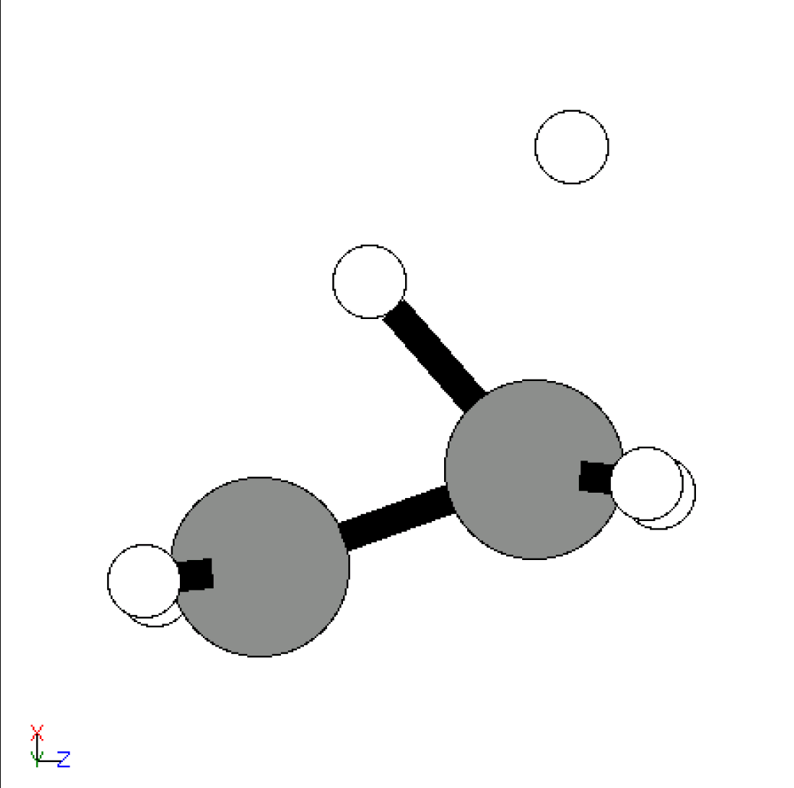
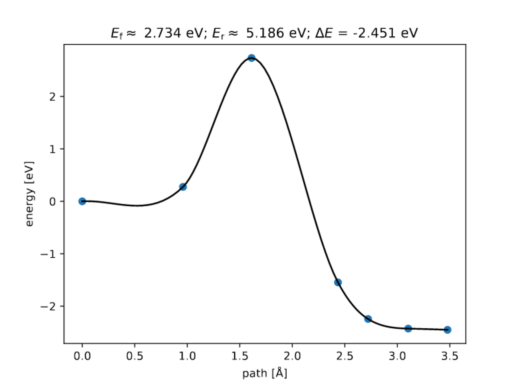

# Orienta


This project is used for merging two atoms with minimal VSPER repulsion.


## Usage


If you want to use Orienta implementing molecule docking, you need to follow steps:
1. prepare two molecule files in format xyz(recommanded) or vasp-POSCAR(with suffix .vasp), with name mol1 and mol2 respectively. 
2. Decide atom indexes of docking of each molecule, named site1 or site2. These indexes can be one or two integers.
3. Decide outputname as output filename (charge and nimages if you want to implement NEB calculations)
4. Implement the code with the following commands:

```
export PYTHONPATH=$PWD/orienta

python orienta/orienta.py mol1 mol2 --site1 site1  --site2 site2 --output outputname --charge 0 --run_opt --run_neb --nimages nimages
```

Then orienta will find molecule minimum repulsion and merge two molecule with specific sites, running with the outputname, charge, and NEB.


## Example

If you want to make `C2H4` react with `H2`, you can use

```bash
python -u ~/atomse/gase/renet/orienta.py C2H4 H2 --site1 0 1 --site2 0 1 --output 3 --charge 0 --run_opt --run_neb --nimages 5
```

Orienta will use ASE to create `C2H4` and `H2` molecule structure, dock `H2` molecule parallel with `C2H4` two Carbon atoms, creating structure `End` and `Start`.


End             |  Start
:-------------------------:|:-------------------------:
  |  


Then orienta create NEB chain and run NEB optimization with the calculator(e.g. Gaussian, Quantum Espresso, etc.), get the TS and NEB plot.

TS             |  NEB-plot
:-------------------------:|:-------------------------:
  |  
