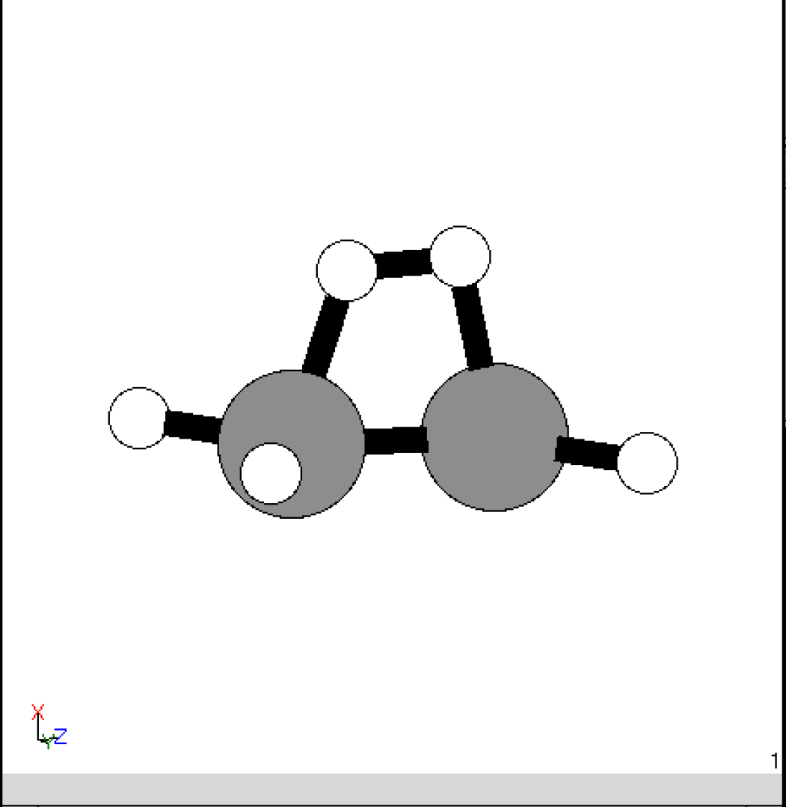
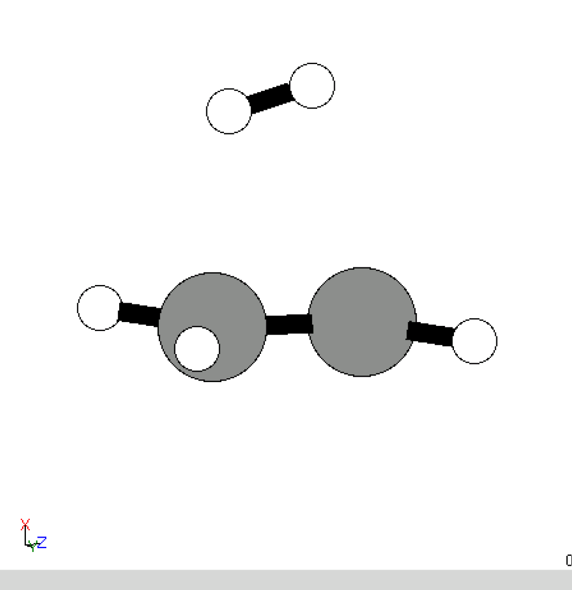
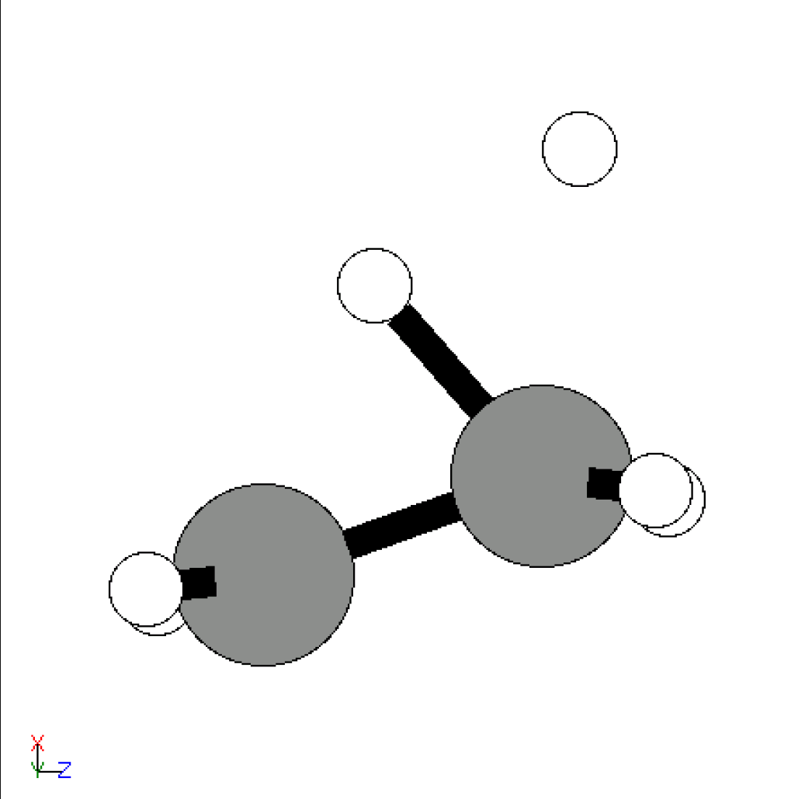
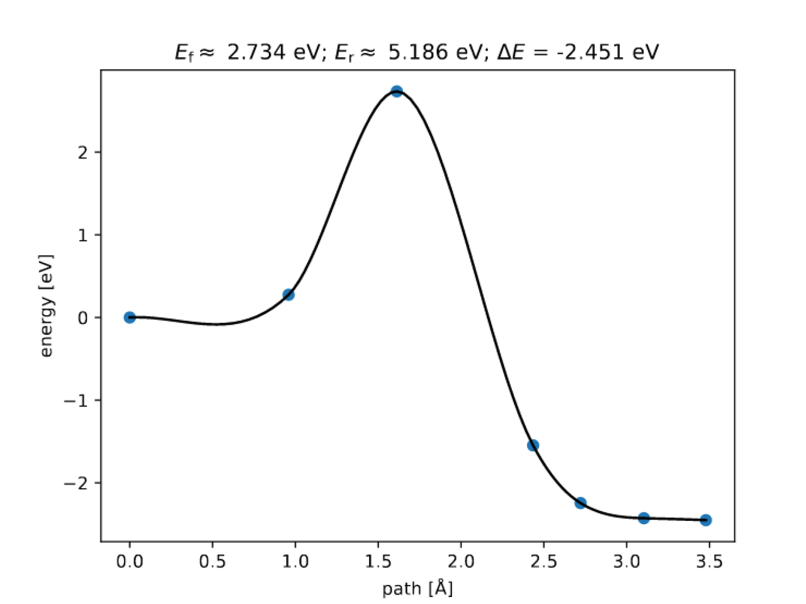

# Oriental


本项目用于以最小 VSEPR 排斥的方式合并两个原子。

## 使用方法


如果你想使用 Orienta 进行分子对接，需要按照以下步骤操作：

1. 准备两个分子文件，格式为 xyz（推荐）或 vasp-POSCAR（后缀为 .vasp），分别命名为 mol1 和 mol2。
2. 确定每个分子的对接原子索引，分别命名为 site1 和 site2。这些索引可以是一个或两个整数。
3. 指定输出文件名（如果需要进行 NEB 计算，还需指定电荷数和 images 数量）。
4. 使用以下命令运行代码：

```bash
export PYTHONPATH=$PWD/orienta

python orienta/orienta.py mol1 mol2 --site1 site1 --site2 site2 --output outputname --charge 0 --run_opt --run_neb --nimages nimages

```


然后 Orienta 会找到分子最小排斥的取向，并按指定位点合并两个分子，使用指定的输出文件名、电荷数进行 NEB 计算。

## 示例
如果你想使 C2H4 与 H2 发生反应，可以使用以下命令：

```bash
python -u ~/atomse/gase/renet/orienta.py C2H4.xyz H2.xyz --site1 0 1 --site2 0 1 --output 3 --charge 0 --run_opt --run_neb --nimages 5
```


Orienta 将使用 C2H4 和 H2 的分子结构，将 H2 分子平行对接在 C2H4 的两个碳原子上，生成 End 和 Start 结构。

End             |  Start
:-------------------------:|:-------------------------:
  |  


然后 Orienta 会创建 NEB 链，并使用指定的计算程序（例如 Gaussian、Quantum Espresso 等）运行 NEB 优化，得到过渡态结构和 NEB 能量路径图。

TS             |  NEB-plot
:-------------------------:|:-------------------------:
  |  
